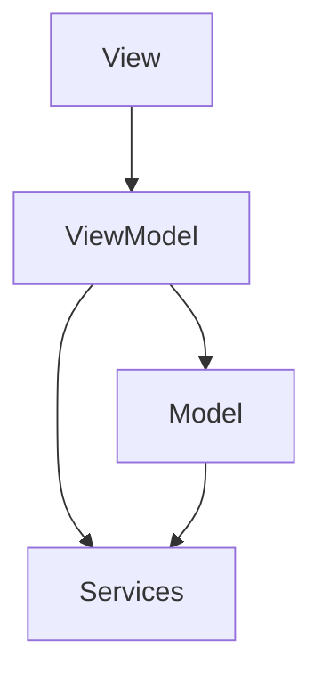

# AppMinhasCompras - Documentação Completa 🛒📱


## 📌 Índice
1. [Visão Geral](#visão-geral)
2. [Funcionalidades](#funcionalidades)
3. [Tecnologias Utilizadas](#tecnologias-utilizadas)
4. [Arquitetura do Projeto](#arquitetura-do-projeto)
5. [Instalação e Configuração](#instalação-e-configuração)
6. [Estrutura de Pastas](#estrutura-de-pastas)
7. [Explicação Detalhada do Código-Fonte](#explicação-detalhada-do-código-fonte)
8. [Capturas de Tela](#capturas-de-tela)
9. [Fluxo de Funcionamento](#fluxo-de-funcionamento)
10. [Contribuição](#contribuição)
11. [Licença](#licença)

## 🌐 Visão Geral
AppMinhasCompras é um aplicativo móvel multiplataforma desenvolvido para auxiliar usuários a gerenciar suas listas de compras de forma simples e intuitiva.

## 🚀 Funcionalidades
- Criar novas listas de compras
- Adicionar itens às listas
- Marcar itens como comprados
- Remover itens
- Salvar múltiplas listas
- Interface responsiva e amigável

## 💻 Tecnologias Utilizadas
- Linguagem: C#
- Framework: .NET MAUI
- Padrão de Arquitetura: MVVM (Model-View-ViewModel)
- Persistência de Dados: SQLite

## 🏗️ Arquitetura do Projeto
O projeto segue o padrão arquitetural MVVM:
- **Models**: Representam as entidades de dados
- **Views**: Interfaces de usuário
- **ViewModels**: Lógica de negócio e manipulação de dados
- **Services**: Serviços de persistência e operações

### Diagrama de Arquitetura


## 🔧 Instalação e Configuração
### Pré-requisitos
- .NET 7 SDK
- Visual Studio 2022 com carga de trabalho .NET MAUI
- Ambiente de desenvolvimento para Android/iOS/Windows

### Passos de Instalação
1. Clone o repositório
2. Abra a solução no Visual Studio
3. Restaure os pacotes NuGet
4. Selecione a plataforma-alvo
5. Compile e execute o projeto

## 📂 Estrutura de Pastas
```
AppMinhasCompras/
│
├── Models/
│   ├── ListaCompras.cs
│   └── ItemCompra.cs
│
├── Views/
│   ├── MainPage.xaml
│   ├── CriarListaPage.xaml
│   └── DetalhesListaPage.xaml
│
├── ViewModels/
│   ├── MainViewModel.cs
│   └── ListaComprasViewModel.cs
│
└── Services/
    ├── IDataService.cs
    └── SQLiteDataService.cs
```

## 💻 Explicação Detalhada do Código-Fonte

### Model: ListaCompras.cs
```csharp
public class ListaCompras
{
    // Propriedades da lista de compras
    public int Id { get; set; }
    public string Nome { get; set; }
    public DateTime DataCriacao { get; set; }
    public List<ItemCompra> Itens { get; set; }
}

public class ItemCompra
{
    // Propriedades do item de compra
    public int Id { get; set; }
    public string Nome { get; set; }
    public double Quantidade { get; set; }
    public bool Comprado { get; set; }
}
```

### ViewModel: ListaComprasViewModel.cs
```csharp
public class ListaComprasViewModel : INotifyPropertyChanged
{
    private ObservableCollection<ListaCompras> _listaCompras;
    
    public ObservableCollection<ListaCompras> ListaCompras 
    {
        get => _listaCompras;
        set 
        {
            _listaCompras = value;
            OnPropertyChanged();
        }
    }

    // Comandos para manipulação de listas
    public ICommand CriarListaCommand { get; }
    public ICommand AdicionarItemCommand { get; }
    public ICommand RemoverItemCommand { get; }

    // Lógica de negócio para gerenciamento de listas
}
```

### Service: SQLiteDataService.cs
```csharp
public class SQLiteDataService : IDataService
{
    private SQLiteAsyncConnection _database;

    // Métodos para persistência de dados
    public async Task<List<ListaCompras>> ObterTodasListas()
    {
        // Lógica para recuperar listas do banco
    }

    public async Task SalvarLista(ListaCompras lista)
    {
        // Lógica para salvar lista no banco
    }
}
```

## 🖼️ Capturas de Tela
**NOTA**: Substitua pelos seus próprios screenshots


## 🎥 Demonstração
**NOTA**: Substitua pelo seu próprio GIF de demonstração


## 🔄 Fluxo de Funcionamento
1. Usuário abre o aplicativo
2. Visualiza listas existentes
3. Pode criar nova lista
4. Adiciona itens à lista
5. Marca itens como comprados
6. Salva e gerencia múltiplas listas

## 🤝 Contribuição
1. Faça um fork do projeto
2. Crie uma branch para sua feature
3. Commit suas alterações
4. Abra um Pull Request

## 📄 Licença
Projeto licenciado sob MIT License.

---

**Desenvolvido com ❤️ por Victor**
